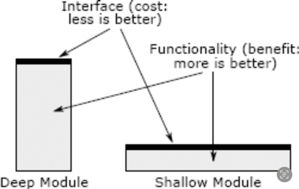

# KISS Principle

> Keep it simple, stupid!

Designs and/or systems should be as simple as possible. Wherever possible, complexity should be avoided in a system—as simplicity guarantees the greatest levels of user acceptance and interaction.

## Modules should be deep

> “Deep and shallow modules. The best modules are deep: they allow a lot of functionality to be accessed through a simple interface. A shallow module is one with a relatively complex interface, but not much functionality: it doesn't hide much complexity.”

A Philosophy of Software Design by John Ousterhout

## Many Small Things or One Big Thing?
Bring together
- if information is shared
- if it reduces complexity
- to remove duplication