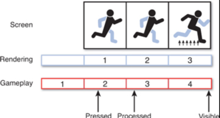

# Game Loop



The Game Loop Pattern describes different ways of simulating a continuous, real-time simulation even though a computer program only runs a set of instructions and then ends.

- Unity: [Order of Execution](https://docs.unity3d.com/Manual/ExecutionOrder.html)
- C#: Game Frameworks like XNA have a Game Loop
- C++: Game Frameworks like SFML have a Game Loop

## Simple Game Loop

```c++
while(true) {
    pollEvents();
    update();
    render();
}
```

Problem: Inconsistent number of updates

## Update With DeltaTime

```c++
const int FPS{30};
const int MS_PER_FRAME{1000};
int lastMs{getTime()};
while(true) {
    int currentMs{getTime()};
    pollEvents();
    update(currentMs-lastMs);
    render();
    lastMs = currentMs;
}
```

- Problem: Your game will update with different delta times.
- This can cause bugs
  - e.g. in case of a 1 second lag
  - in which the player walks through a wall.

## Basic Fixed Update

```c++
const int FPS{30};
const int MS_PER_FRAME{1000};
while(true) {
    int msStart{getTime()};
    pollEvents();
    fixedUpdate();
    render();
    int msPassed = getTime() - msStart;
    wait(MS_PER_FRAME - msPassed);
}
```

- Problem: Will slow your Game Down
  - if rendering takes long
  - and you reach less than 30 FPS

## Advanced Fixed Update

```c++
const int FPS{30};
const int MS_PER_FRAME{1000};
int msLastUpdate{getTime()};
while(true){
    int msStart{getTime()};
    pollEvents();
    while(getTime() > msLastUpdate + MS_PER_FRAME) {
        fixedUpdate();
        msLastUpdate += MS_PER_FRAME;
    }
    update();
    render();
}
```

Problem: What, if a one-time lag causes two fixed updates to happen once?
- Now, these two fixed updates happening continuously take so long
- That for the next frame
  - again two fixed updates need to happen