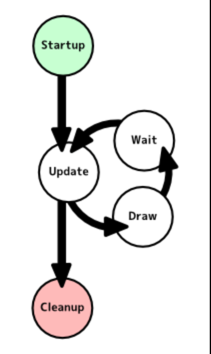

# Update Method



The Update Method Pattern describes a solution to simulate a collection of independent objects updating themselves one frame at a time.

## The Problem with Procedural Programming

```c++
class Monster {
   int pos_x, pos_y;
public:
   void Play() {
      while(true) {
        // walk right
        for(int i = 0; i < 100; i++) {
            pos_x++;
        }
        // walk left
        for(int i = 0; i < 100; i++) {
            pos_x++;
        }
        // repeat
      }
   }
};
```

## Update Method

```c++
vector<GameObject> game_objects{};

while(true) {
   for(auto& go : game_objects) {
      go.update();
   }
}
```

## Problem: Saving State

```c++
class Monster {
   int pos_x, pos_y;
   bool moving_right;
   int step_count;
   const int count_per_iteration;
public:
   void Update() {
      while(true) {
        
      }
   }
};
```