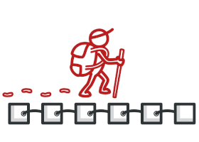

# Iterator Pattern



The Iterator Pattern is a Design Pattern used in Programming to allow us to sequentially visit all items in any type of collection.

## The Problem

There are many different types of Collections: `Array`, `List`, `Stack`, `Queue`, `Tree`, `Graph`, ...

But then, how can we define a standardized way for looking at all items in a collection?

## The Concept

```c++
class IIterator {
public:
    // Tells you whether there are any more elements
    virtual bool HasNext() = 0;
    // Returns the next element
    virtual void* GetNext() = 0;
};
```

```c++
class ICollection {
public:
    // Returns an object used for iterating over all elements
    virtual IIterator* GetIterator() = 0;
};
```
Now, this interface can be used as follows:


```c++
ICollection* anyCollection = CreateRandomCollection();
IIterator* iterator = anyCollection->GetIterator();
while (iterator->HasNext()) {
    std::cout << "Next Element: " << iterator->GetNext() << std::endl;
}
```

## Iterable

In C++, the concept of IEnumerable is typically implemented using iterators, but there isn't a standardized interface like in C#. The closest equivalent would be to use the range-based for loop for iterable types.

## Iterators in C++

In C++, iterators are typically implemented as part of the iterable class. The standard library provides the concept of iterators for various containers, and you can implement your own custom iterators for custom classes.

Here's a basic example:

```c++
class CustomIterator {
public:
    // Constructor, etc.

    // Advances the iterator to the next element
    virtual bool MoveNext() = 0;

    // Returns the current element
    virtual void* GetCurrent() = 0;

    // Other methods if needed
};

class CustomCollection {
public:
    // Returns an iterator for the collection
    virtual CustomIterator* begin() = 0;
    virtual CustomIterator* end() = 0;

    // Other methods if needed
};
```


The usage would then be:

```c++
CustomCollection* anyCollection = CreateRandomCollection();
for (auto iterator = anyCollection->begin(); iterator != anyCollection->end(); iterator->MoveNext()) {
    std::cout << "Next Element: " << iterator->GetCurrent() << std::endl;
}
```

## Range-based for loop in C++

The range-based for loop in C++ simplifies the iteration over containers that provide the necessary methods (`begin()` and `end()` ). It abstracts away the iterator details.

```c++
std::vector<int> numbers = {2, 5};
for (int number : numbers) {
    std::cout << number << std::endl;
}
```

This loop works for any type that provides `begin()` and `end()` methods, making it easy to iterate over your custom collections.

```c++
CustomCollection* customCollection = CreateCustomCollection();
for (auto element : *customCollection) {
    std::cout << "Next Element: " << element << std::endl;
}
```